PAV - P5: síntesis musical polifónica
=====================================

Obtenga su copia del repositorio de la práctica accediendo a [Práctica 5](https://github.com/albino-pav/P5) y
pulsando sobre el botón `Fork` situado en la esquina superior derecha. A continuación, siga las instrucciones de la
[Práctica 3](https://github.com/albino-pav/P3) para crear una rama con el apellido de los integrantes del grupo de
prácticas, dar de alta al resto de integrantes como colaboradores del proyecto y crear la copias locales del
repositorio.

Como entrega deberá realizar un *pull request* con el contenido de su copia del repositorio. Recuerde que los
ficheros entregados deberán estar en condiciones de ser ejecutados con sólo ejecutar:

~~~~~~~~~~~~~~~~~~~~~~~~~~~~~~~~~~~~~~~~~~~~~~~~~~~~~.sh
  make release
~~~~~~~~~~~~~~~~~~~~~~~~~~~~~~~~~~~~~~~~~~~~~~~~~~~~~

A modo de memoria de la práctica, complete, en este mismo documento y usando el formato *markdown*, los ejercicios
indicados.

Ejercicios.
-----------

### Envolvente ADSR.

Tomando como modelo un instrumento sencillo (puede usar el InstrumentDumb), genere cuatro instrumentos que permitan
visualizar el funcionamiento de la curva ADSR.

* Un instrumento con una envolvente ADSR genérica, para el que se aprecie con claridad cada uno de sus parámetros:
  ataque (A), caída (D), mantenimiento (S) y liberación (R).

  ADSR_A=0.02; ADSR_D=0.1; ADSR_S=0.4; ADSR_R=0.1;

  <p align="center">
  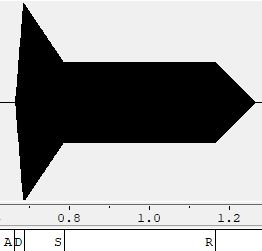
  </p>


* Un instrumento *percusivo*, como una guitarra o un piano, en el que el sonido tenga un ataque rápido, no haya
  mantenimiemto y el sonido se apague lentamente.
  - Para un instrumento de este tipo, tenemos dos situaciones posibles:
    * El intérprete mantiene la nota *pulsada* hasta su completa extinción.

      ADSR_A=0.02; ADSR_D=0.1; ADSR_S=0; ADSR_R=0.5;

    <p align="center">
    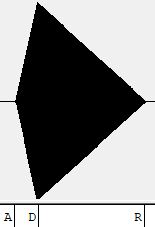
    </p>


    * El intérprete da por finalizada la nota antes de su completa extinción, iniciándose una disminución rápida del
      sonido hasta su finalización.

      ADSR_A=0.02; ADSR_D=0.2; ADSR_S=0; ADSR_R=0; 

    <p align="center">
    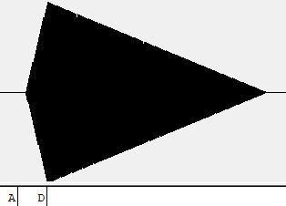
    </p>


* Un instrumento *plano*, como los de cuerdas frotadas (violines y semejantes) o algunos de viento. En ellos, el
  ataque es relativamente rápido hasta alcanzar el nivel de mantenimiento (sin sobrecarga), y la liberación también
  es bastante rápida.

  ADSR_A=0.03; ADSR_D=0; ADSR_S=0.4; ADSR_R=0.07;

  <p align="center">
  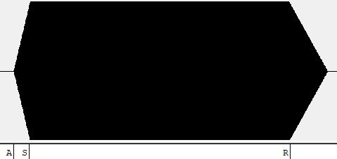
  </p>


### Instrumentos Dumb y Seno.

Implemente el instrumento `Seno` tomando como modelo el `InstrumentDumb`. La señal **deberá** formarse mediante
búsqueda de los valores en una tabla.

- Incluya, a continuación, el código del fichero `seno.cpp` con los métodos de la clase Seno.

```cpp
#include <iostream>
#include <math.h>
#include "seno.h"
#include "keyvalue.h"

#include <stdlib.h>

using namespace upc;
using namespace std;

Seno::Seno(const std::string &param)
 : adsr(SamplingRate, param) {
 bActive = false;
 x.resize(BSIZE);
 
 KeyValue kv(param);
 int N;

 if (!kv.to_int("N",N))
 N = 40;

 tbl.resize(N);
 float phase=0, step=2*M_PI/(float)N;
 index = 0;
 for (int i=0; i < N ; ++i) {
 tbl[i] = sin(phase);
 phase += step;
 }
}

void Seno::command(long cmd, long note, long vel) {
 if (cmd == 9) {
 bActive = true;
 adsr.start();
 step = 0;
 index = 0;
 findex = 0;
 accstep = 0;
 N=100;
 f0=440.0*pow(2,(((float)note-69.0)/12.0));
 nota=f0/SamplingRate;
 step=nota*N;
 A=vel/127.;
 } 
  else if (cmd == 8) {
    adsr.stop();
  }
  else if (cmd == 0) {
    adsr.end();
  }
}

const vector<float> & Seno::synthesize() {
  if (not adsr.active()) {
    x.assign(x.size(), 0);
    bActive = false;
    return x;
  }
  else if (not bActive)
    return x;

 for (unsigned int i=0; i < x.size() ; ++i) {
  findex += step;
  if(findex>=tbl.size()){
    findex = findex - tbl.size(); 
  }
  prev = (int)findex;
  weight = findex-prev;
  if(prev==tbl.size()-1){
    next=0;
  }
  else next = prev+1;
  x[i] = weight*A*tbl[prev]+(1-weight)*A*tbl[next];  
  //x[i] = (A*tbl[prev]+A*tbl[next])/2;  
  }
  adsr(x);
  return x;
}
```

- Explique qué método se ha seguido para asignar un valor a la señal a partir de los contenidos en la tabla, e incluya
  una gráfica en la que se vean claramente (use pelotitas en lugar de líneas) los valores de la tabla y los de la
  señal generada.

  - En el `constructor` del instrumento `Seno` llenamos un vector tabla que contendrá el contorno de una señal senoidal. Si N=40, la tabla almacenará un período de un seno con un 40 muestras de resolución.

<p align="center">
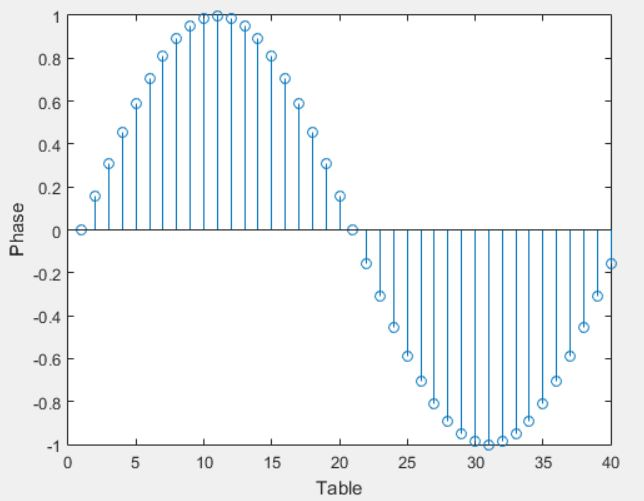
</p>

  En la función `command()` calculamos la frecuencia de las notas entrantes del fichero `sco` una vez se inicia la fase de ataque en la envolvente ADSR. Para cada nota recorreremos la tabla a unos `steps` determinados que vienen dados por la expresión `step=fnota*N/SamplingRate`, ya que la proporción entre la frecuencia en Hz de la nota y la de muestreo ha de ser la misma que la de exploración de la tabla frente su longitud.
  Por ejemplo si se diese el caso en que step=2*N, se escogerán de la tabla las fases cada 2 muestras, obteniendo a la salida una señal con menor resolución por período porque incrementa su frecuencia. En la imagen siguiente se demuestra:

<p align="center">
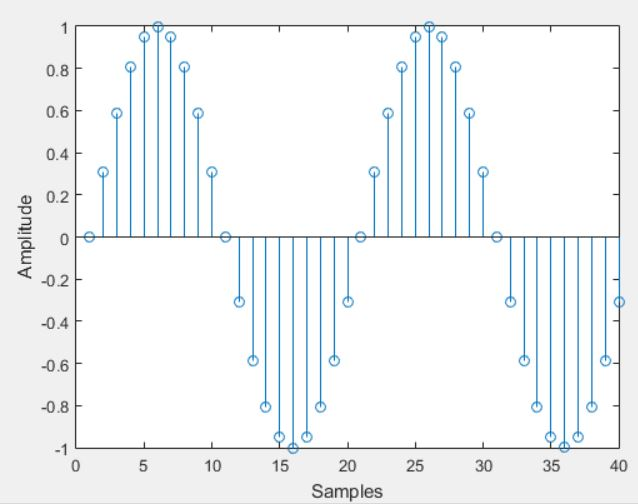
</p>

  El hecho de recorrer la tabla mientras se da una misma nota se hace en `synthesize()` donde incrementamos el step prudentemente para acceder a los valores de la tabla y poner el valor adecuado para la señal de salida. Normalmente el step no llegará a 1 y ha de acceder a un nuevo índice de la tabla cada vez que la acumulación de steps llegue a un nuevo entero.

  Por tal de mejorar la salida, realizamos una interpolación entre la muestra posterior y siguiente de la tabla de forma proporcional a la distancia del step acumulado entre los dos enteros.

  Muestra del señal resultante en el fichero .wav

<p align="center">
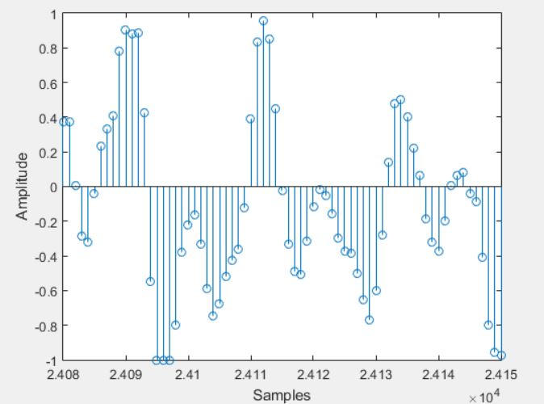
</p>

### Efectos sonoros.

- Incluya dos gráficas en las que se vean, claramente, el efecto del trémolo y el vibrato sobre una señal sinusoidal.

  Tremolo:

  El efecto del tremolo se puede ver a simple vista, consiste en la oscilación de la amplitud a lo largo del tiempo.
<p align="center">
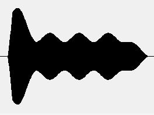
</p>

    Vibrato

    A simple vista desde un analisis temporal no podemos ver el efecto del vibrato, hemos de hacer una representación espectral para apreciarlo, ya que las oscilaciones ahora se encuentran en la frecuencia y varían a lo largo del tiempo.

<p align="center">
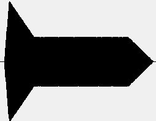
</p>
<p align="center">
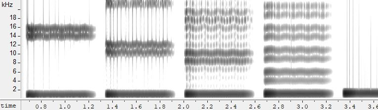
</p>

### Síntesis FM.

Construya un instrumento basado en síntesis FM, siguiendo las explicaciones contenidas en el enunciado y el artículo
de [John M. Chowning](https://ccrma.stanford.edu/sites/default/files/user/jc/fm_synthesispaper-2.pdf). El instrumento
usará como parámetros **básicos** los números `N1` y `N2`, y el índice de modulación `I`, que deberá venir expresado
en semitonos.

- Use el instrumento para generar un vibrato de *parámetros razonables* e incluya una gráfica en la que se vea,
  claramente, la correspondencia entre los valores `N1`, `N2` e `I` con la señal obtenida.

  - Por tal de encontrar el valoe exacto para `fm` usamos la relación siguiente:
  <p align="center">
  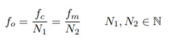
  </p>

  `I` es la amplitud de la componente oscilatoria de fm, que aparece a lo largo de la evolución temporal del señal generando armónicos.

  <p align="center">
  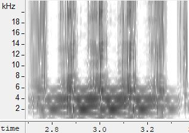
  </p>

  Para probar esta nueva funcionalidad hemos añadido la nueva componente sinusoide al nuevo `Instrumento FM`

- Use el instrumento para generar un sonido tipo clarinete y otro tipo campana. Tome los parámetros del sonido (N1,
  N2 e I) y de la envolvente ADSR del citado artículo. Con estos sonidos, genere sendas escalas diatónicas (fichero
  `doremi.sco`) y ponga el resultado en los ficheros `work/doremi/clarinete.wav` y `work/doremi/campana.work`.

  - Para el clarinete hemos usado una proporción fc/fm de 5/1 (N1=100 N2=20, I=0.5) y para las componentes ADSR: A=0.03, D=0, S=0.4, R=0.07.

  - Para la campanilla hemos usado una proporción fc/fm de 1/1.4 (N1=100 N2=140, I=1) y para las componentes ADSR: A=0.02, D=2, S=0, R=0. 

### Orquestación usando el programa synth.

Use el programa `synth` para generar canciones a partir de su partitura MIDI. Como mínimo, deberá incluir la
*orquestación* de la canción *You've got a friend in me* (fichero `ToyStory_A_Friend_in_me.sco`) del genial
[Randy Newman](https://open.spotify.com/artist/3HQyFCFFfJO3KKBlUfZsyW/about).

- En este arreglo, la pista 1 corresponde al instrumento solista (puede ser un piano, flautas, violines,
  etc.), y la 2 al bajo (bajo eléctrico, contrabajo, tuba, etc.).
- Coloque el resultado, junto con los ficheros necesarios para generarlo, en el directorio `work/music`.
- Indique, a continuación, la orden necesaria para generar la señal (suponiendo que todos los archivos necesarios
  están en direcotorio indicado).

    `synth instruments.orc -e effects.orc ToyStory_A_Friend_in_me.sco ToyStory_A_Friend_in_me.wav`